# Machine Learning Engineer Nanodegree
## Arvato's Costumer Segmentation Capstone Proposal
Rafael Dias

October 3rd, 2020

## Proposal
 

### Domain Background

Customer segmentation refers to the task of dividing a population of customers into different buckets according to their characteristics. This task is performed in a unsupervised fashion, meaning that we don't have previous ground truth information about the landing groups.

General demographic information provides valuable information about population and latent characteristics that can be used to group them into different groups for study. If we have demographic information for both existing customer base and general population, we can use this segmentation to evaluate potential customers.

One way to reach for new users is throughout a mail order campaign, which costs money and, if done carelessly, may lead opposite results if people feel bothered. That's were predictive model comes in place, providing the probability of an individual to respond  to campaign based on  historical data of previous campaigns.

### Problem Statement

This projects is comprised of two main tasks: 
 - Generating a Customer Segmentation report based on demographic information of general population using unsupervised methods (such as k-Means)
 - Binary classification of people responding to mail order campaign based on customer segmentation and mail order campaign response results, using supervised methods (such as Naive Bayes, SVM, Neural Networks and XGB)

### Datasets and Inputs
This project will use demographic data from general Germany population, from Arvato's costumers and from targets of a marketing campaign in order to draw strategies  for customer acquisition.

Due to sensitive and proprietary nature of data (although anonymized), the data is not publicly available but restricted to Udacity student's that sign off to terms of usage. Due to this restriction, the dataset will not be provided  as part of this project and a link for [terms of usage](https://classroom.udacity.com/nanodegrees/nd009t/parts/2f120d8a-e90a-4bc0-9f4e-43c71c504879/modules/7e69b87a-bf80-428e-89bf-358b2721fc16/lessons/4f0118c0-20fc-482a-81d6-b27507355985/concepts/bea4372b-5c40-4030-b324-9b2c291e55ae) will be provided instead.

Please note that this link is restricted to Nanodegree students.

For first task (Customer Segmentation Report) the following datasets with demographics data shall be used
-   `Udacity_AZDIAS_052018.csv`, with data from general population of Germany
	-  	891 211 persons (rows) x 366 features (columns).
-   `Udacity_CUSTOMERS_052018.csv`, with data from mail-order customers of a mail-order company
	- 191 652 persons (rows) x 369 features (columns).

For the second task, (Mail-order Response Prediction) the following datasets with demographics data for targets of a marketing campaign shall be used:
-   `Udacity_MAILOUT_052018_TRAIN.csv`: 42 982 persons (rows) x 367 (columns).
-   `Udacity_MAILOUT_052018_TEST.csv`:  42 833 persons (rows) x 366 (columns).

### Solution Statement
In the first stage, clustering algorithms will be used to segment people into different groups, based on their demographics data and a further analysis will be performed to evaluate potential new customers based on general population data.

In the second stage, this initial analysis will be expanded throughout the usage of binary classification algorithms in order to explore previous marketing campaign results data to predict whether potential customers are likely to respond to market campaign or not.

### Benchmark Model
The final step of this project is a [Kaggle competition](https://www.kaggle.com/c/udacity-arvato-identify-customers/overview/evaluation) submission for evaluation, and thus a benchmark is readily available.

The output predictions of the binary classifier over the test set is submitted into Kaggle which uses this data to compute a score metric (AuC for the ROC curve) and rank among other competitors.

### Evaluation Metrics
In compliance with the benchmark (Kaggle Competition), the ROC AuC metric will be used as evaluation metric.

The Receiving Operator Characteristics curve is a plot that illustrates the binary classifier performance as the discrimination threshold varies [[1]](https://en.wikipedia.org/wiki/Receiver_operating_characteristic), [[2]](https://developers.google.com/machine-learning/crash-course/classification/roc-and-auc), as depicted in the image bellow.

ROC curve of three predictors of peptide cleaving in the [proteasome](https://en.wikipedia.org/wiki/Proteasome "Proteasome").

The AuC (Area under the Curve) for ROC, represents the probability that the model ranks a random positive example higher than a random negative example in a scale invariant and threshold independent fashion 
 [[2]](https://developers.google.com/machine-learning/crash-course/classification/roc-and-auc).

Formally, the AuC can be defined as:

Where TPR stands for [True Positive Rate](https://en.wikipedia.org/wiki/True_positive_rate) and FPR stands for [False Positive Rate](https://en.wikipedia.org/wiki/False_positive_rate) as such:

In addition to overall performance evaluation, the model will also be evaluated with regards to fairness [\[3\]](https://pair-code.github.io/what-if-tool/ai-fairness.html) in order to access if it has any considerable bias towards any gender.

### Project Design
The overall workflow for this project is depicted in the image bellow and detailed in the next sub-sections.

#### Customer Segmentation Report

##### Exploratory Data Analysis

An Exploratory Data Analysis (EDA) will be performed on demographics data in order to detect problems such as missing values and to understand the nature of features and their ranges. This analysis will serve to provide specific strategies for data cleanup and feature transformations.

##### Data cleanup 
Once there is information about the nature of data and existing problems, a data cleanup will be performed to handle missing and invalid data either by dropping rows or by fixing values.

##### Feature Selection, Transformation and Normalization
Based on the EDA, some features may be removed (due to high correlation), some features may be created by combination of others and some features may need to be transformed using strategies such as encoding and discretization.

Finally, features shall be normalized in order to put them in ranges with comparable values. This step is important  to avoid that the models given unrealistic importance to features due to value ranges.

##### Dimensionality Reduction
Given the high number of features, it is important to use a dimensionality reduction technique such as PCA before running the clustering algorithm in order to avoid the [curse of dimensionality](https://en.wikipedia.org/wiki/Curse_of_dimensionality).

Note: Same transformation and dimensionality reduction pipeline will be applied to all demographics data.

##### Clustering
Once the data is prepared, a clustering algorithm such as k-Means will be used to group population individuals based  on their demographic attributes.

There is no pre-defined number of cluster for this task and the [elbow method](https://en.wikipedia.org/wiki/Elbow_method_%28clustering%29) will be used as heuristic to determine the number of clusters, running on a sample of data.

##### Segmentation and Analysis
Once the clusters are formed, each group will be analyzed to provide clues about their composition.
In the sequence, the cluster model will be used to classify existing customers into same groups in order to identify potential users.

#### Marketing Response Prediction
##### Feature Transformation
Same transformation and dimensionality reduction pipeline of previous stage will be applied to mail order campaign data.

##### Model Training
A series of binary classifiers algorithms such as XGB, Neural Networks, SVM and Naive Bayes will be evaluated for candidate model.

Training process will rely on optimization strategies for hyper-parameters tuning and on cross-validation to avoid over-fitting (and hence bad generalization).

##### Evaluation
After models have been trained and scored using cross-validation, an additional evaluation will be performed to assess AI Fairness towards equal opportunity [\[3\]](https://pair-code.github.io/what-if-tool/ai-fairness.html).

The most suitable model will then be selected to compute predictions on test set for Kaggle submission and to compute test score using AuC for ROC.

### References
- [1\] - https://en.wikipedia.org/wiki/Receiver_operating_characteristic
- \[2\] - https://developers.google.com/machine-learning/crash-course/classification/roc-and-auc
- \[3\] - https://pair-code.github.io/what-if-tool/ai-fairness.html

